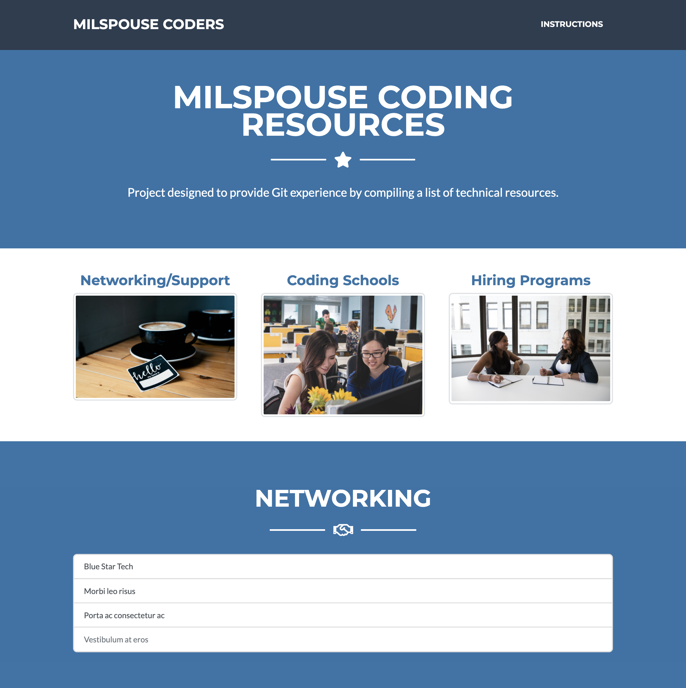

# Welcome to the Learning Repository for [MilSpouse Coders](https://milspousecoders.org/)!
MilSpouse Coders Is Dedicated To Empowering Military Spouses Around The Globe To Find Challenging And Fulfilling Careers In Technology.

### The website is hosted using GitHub pages [here](https://milspousecoders.github.io/MSC-Coding-Resources/) 
- The files to edit are located in the `dist` folder and changes are made using a `npm run deploy` script (that a project maintainer will run).  
- If you are using Visual Studio Code, it is recommended to use a [live preview extension](https://marketplace.visualstudio.com/items?itemName=george-alisson.html-preview-vscode) (Toggle Preview - ctrl+shift+v or cmd+shift+v) or check your progress by opening the .html file in your browser.

For those completely new to GitHub, check out the resources [here](https://milspousecoders.github.io/MSC-Coding-Resources/learn-git.html) and read the [MilSpouse Coders' Hacktoberfest Setup](https://github.com/MilSpouseCoders/Hacktoberfest_2020/blob/master/SETUP.md)!  
To contribute, head over to [CONTRIBUTING.md](/CONTRIBUTING.md)

## Feedback

Have an idea or see an error? [Open a new issue!](https://github.com/MilSpouseCoders/MSC-Coding-Resources/issues)
